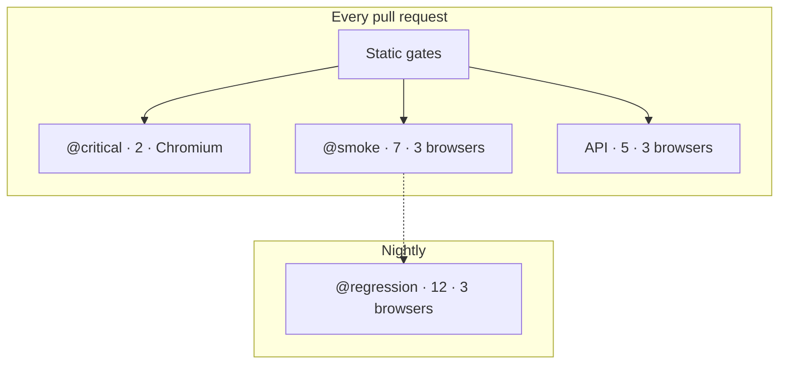
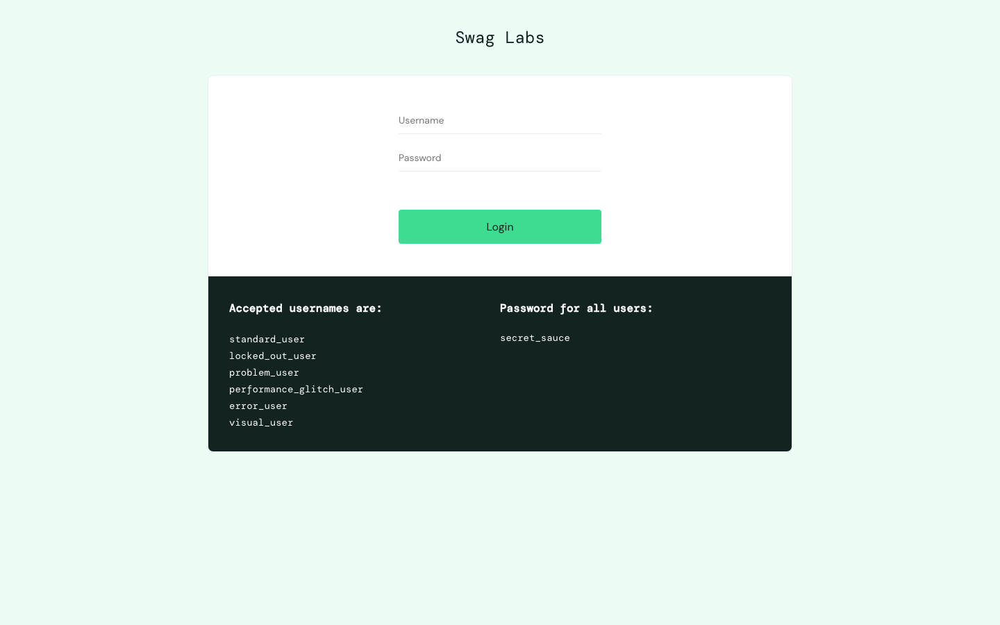
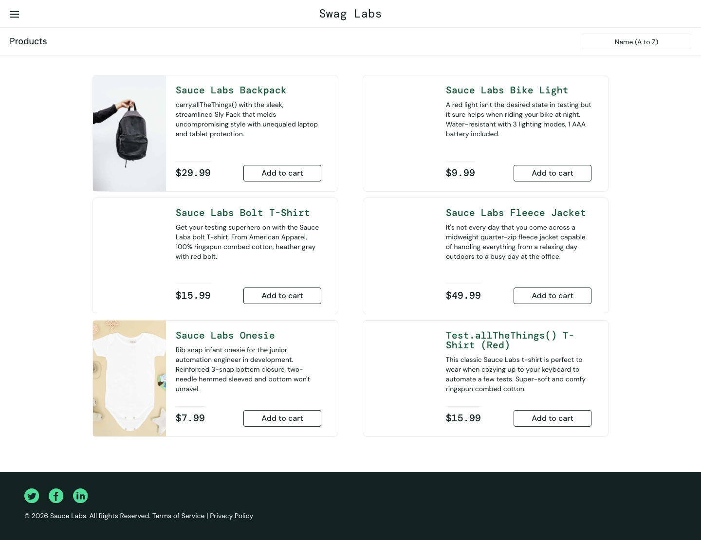
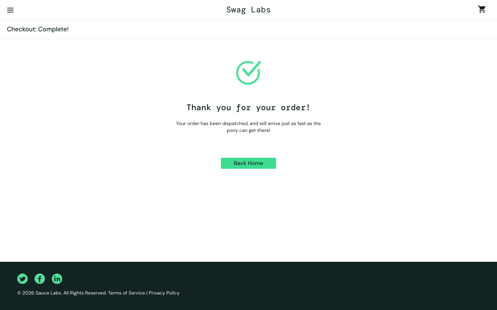

# Playwright Ecommerce Framework

[](https://github.com/AKogut/playwright-ecommerce-framework/actions/workflows/pr-review-smoke.yml)
[](https://github.com/AKogut/playwright-ecommerce-framework/actions/workflows/code-quality.yml)
[](https://github.com/AKogut/playwright-ecommerce-framework/actions/workflows/nightly-regression.yml)
[](LICENSE)

Production-style Playwright + TypeScript E2E framework for [SauceDemo](https://www.saucedemo.com/), focused on maintainability, fast feedback, and CI-ready reporting.

## Portfolio highlights

- **Problem:** E-commerce E2E suites become hard to maintain when selectors, test data, and reporting logic live inside individual specs.
- **Solution:** A layered Playwright + TypeScript framework with Page Objects, merged fixtures, tagged suites, and CI workflows that merge Allure results across browsers.
- **Result:** Faster PR feedback (parallel critical, smoke, and API jobs), reproducible triage artifacts, and a published Allure dashboard after every merge to `main`.

[](https://playwright.dev/)
[](https://www.typescriptlang.org/)
[](https://allurereport.org/)
[](https://github.com/features/actions)

| Suite                      | Scenarios |
| -------------------------- | --------: |
| Smoke (`@smoke`)           |         7 |
| Regression (`@regression`) |        12 |
| API (`tests/api`)          |         5 |
| **Total**                  |    **24** |

Operational metrics:

- Smoke duration target: approximately 3-5 minutes in CI for the full browser matrix.
- Browser matrix: Chromium, Firefox, and WebKit for smoke, regression, and API suites; critical PR gate runs Chromium.
- Retry policy: CI retries failed tests twice; local runs use zero retries for faster feedback.

## Quality at a glance

For reviewers and hiring managers — **[Quality overview (one-pager)](docs/quality-overview.md)** · [Live Allure report](https://akogut.github.io/playwright-ecommerce-framework/)



## What this framework gives you

- Stable Page Object Model with selector abstraction
- Typed fixtures for pages, data, auth, and network mocking
- Clear suite boundaries (`smoke`, `regression`, `critical`, `api`, `untagged`)
- Health-checked global setup and metadata-driven global teardown
- Built-in HTML, JUnit, JSON, and Allure reporting
- CI pipelines for PR critical/smoke checks, quality gates, and nightly regression

## Documentation

Full index and reading paths: **[Documentation hub](docs/README.md)**

| Topic              | Guide                                                                                                                    |
| ------------------ | ------------------------------------------------------------------------------------------------------------------------ |
| Executive summary  | [**Quality overview**](docs/quality-overview.md) (one-pager)                                                             |
| Strategy & quality | [Test strategy](docs/test-strategy.md) · [Tag strategy](docs/tag-strategy.md) · [UI audit](docs/ui-audit-saucedemo.md)   |
| Engineering        | [Architecture](docs/architecture.md) · [Folder structure](docs/folder-structure.md) · [CI pipeline](docs/ci-pipeline.md) |
| Operations         | [Setup guide](docs/setup-guide.md) · [Troubleshooting](docs/troubleshooting.md)                                          |
| Visual proof       | [Demo screenshots](docs/demo-screenshots.md)                                                                             |
| Contributing       | [CONTRIBUTING.md](CONTRIBUTING.md)                                                                                       |

## Quick start

Prerequisites:

- Node.js 24+ (project pin in `.nvmrc`)
- npm 11+ (installed with Node 24)

```bash
cp .env.example .env
npm ci
npx playwright install
npm run test:smoke
```

## Demo screenshots

End-to-end journey under automation ([gallery + spec mapping](docs/demo-screenshots.md)):

<figure>
  
  <figcaption><strong>Login (<code>/</code>)</strong> — Authentication boundary; <code>auth</code> fixture + <code>login-valid.spec.ts</code> (<code>@smoke @critical</code>).</figcaption>
</figure>

<figure>
  
  <figcaption><strong>Inventory (<code>/inventory.html</code>)</strong> — Catalog and cart entry; <code>products-list-visible</code> and <code>add-product-to-cart</code> smoke specs.</figcaption>
</figure>

<figure>
  
  <figcaption><strong>Order confirmation (<code>/checkout-complete.html</code>)</strong> — Purchase path terminus; <code>checkout-happy-path.spec.ts</code> (<code>@smoke @critical</code>).</figcaption>
</figure>

## Useful commands

```bash
# all tests
npm test

# suites
npm run test:smoke
npm run test:regression
npm run test:critical
npm run test:api
npm run test:untagged

# browser-specific projects
npm run test:smoke:chromium
npm run test:smoke:firefox
npm run test:smoke:webkit
npm run test:regression:chromium
npm run test:regression:firefox
npm run test:regression:webkit
npm run test:critical:chromium
npm run test:critical:firefox
npm run test:critical:webkit

# focused quality checks
npm run test:accessibility
npm run test:visual
npm run test:visual:update # refresh visual baseline after intentional UI changes

# static checks
npm run typecheck
npm run lint
npm run format
```

## Reports

**Live Allure report (latest `main` run):** [https://akogut.github.io/playwright-ecommerce-framework/](https://akogut.github.io/playwright-ecommerce-framework/)

If Pages is unavailable or you need a specific workflow run, open the [Smoke Run](https://github.com/AKogut/playwright-ecommerce-framework/actions/workflows/pr-review-smoke.yml) workflow, select the run, and download the **`allure-report-bundle`** artifact (merged HTML). Extract and open `index.html` locally.

```bash
npm run report
npm run report:allure
```

During GitHub Actions runs:

- Playwright HTML report artifacts are uploaded as `playwright-report-<job>-<browser>`.
- Raw Allure results are uploaded as `allure-results-<job>-<browser>`.
- A merged Allure HTML artifact is produced as `allure-report-bundle`.
- On failing jobs, `test-results-<job>-<browser>` includes screenshots, videos, traces.

After merge to `main`, the Smoke Run workflow deploys the merged report to GitHub Pages (`deploy-allure-pages`). See [CI pipeline diagram](docs/ci-pipeline.md) for the full flow.

## Environment variables

Defined in `.env.example`:

- `BASE_URL`
- `STANDARD_USER_USERNAME`, `STANDARD_USER_PASSWORD`
- `LOCKED_USER_USERNAME`, `LOCKED_USER_PASSWORD`
- `PROBLEM_USER_USERNAME`, `PROBLEM_USER_PASSWORD`
- `PERFORMANCE_USER_USERNAME`, `PERFORMANCE_USER_PASSWORD`
- `SKIP_BASE_URL_HEALTHCHECK`
- `BASE_URL_HEALTHCHECK_RETRIES`
- `BASE_URL_HEALTHCHECK_BACKOFF_MS`
- `GLOBAL_TIMEOUT_MS`
- `TEST_TIMEOUT_MS`
- `EXPECT_TIMEOUT_MS`

## License

This project is licensed under the [MIT License](LICENSE).
