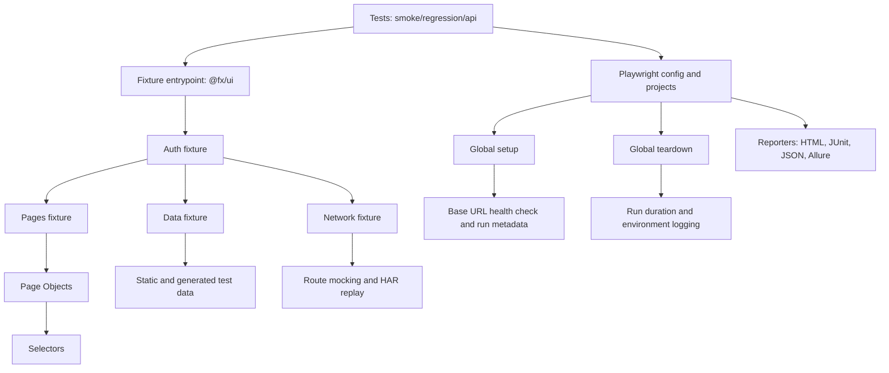

# Architecture

This framework follows a layered architecture where test intent is separated from UI mechanics, selectors, and runtime plumbing.

## High-level diagram

## Runtime flow

1. `playwright.config.ts` defines suite-to-project mapping and reporter stack.
2. `global-setup.ts` validates `baseURL`, performs health-check retries, writes run metadata.
3. Test files import from `@fx/ui`, getting merged fixtures:
   - page objects (`loginPage`, `productsPage`, `cartPage`, `checkoutPage`)
   - test data (`users`, `products`, checkout payloads)
   - network facade (`mockJson`, `mock`, `replayHar`, `clearRoutes`)
   - auth facade (`loginAs`, `loginAsStandardUser`)
4. Page objects consume selectors from `src/selectors` and expose reusable UI actions/assertions.
5. Reporters emit artifacts for local triage and CI publication.
6. `global-teardown.ts` reads metadata and logs run summary with duration and CI context.

## Design principles

- Keep test files declarative and close to business scenarios.
- Keep UI selectors centralized and explicit.
- Keep framework-level reliability concerns in setup/teardown, not in test specs.
- Keep network test helpers reusable and browser-agnostic.
