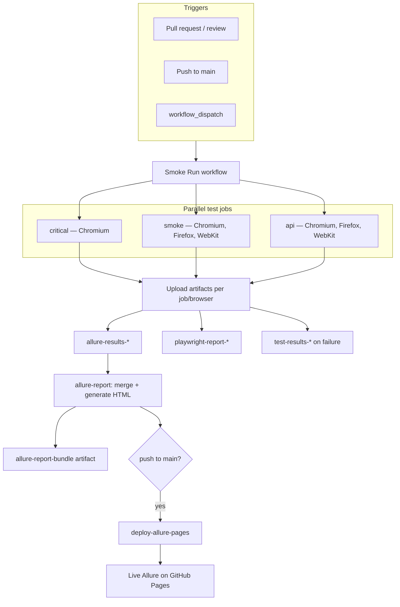

# CI pipeline

How GitHub Actions runs tests, publishes artifacts, and deploys the live Allure report.

## PR and `main` push flow (Smoke Run)

Triggered on pull requests, reviews, pushes to `main`, and manual dispatch. Runs in parallel with [Code Quality Checks](../.github/workflows/code-quality.yml) (typecheck, ESLint, Prettier).

### Job summary

| Job                   | Suite       | Browsers                  | Artifacts                                                     |
| --------------------- | ----------- | ------------------------- | ------------------------------------------------------------- |
| `critical`            | `@critical` | Chromium                  | Allure results, Playwright HTML, failure media                |
| `smoke`               | `@smoke`    | Chromium, Firefox, WebKit | Same                                                          |
| `api`                 | `tests/api` | Chromium, Firefox, WebKit | Same                                                          |
| `allure-report`       | —           | —                         | Merges all `allure-results-*`, uploads `allure-report-bundle` |
| `deploy-allure-pages` | —           | —                         | Publishes merged HTML to GitHub Pages (`main` only)           |

## Nightly regression

[Regression Run](../.github/workflows/nightly-regression.yml) runs on a schedule (`0 1 * * *`) and `workflow_dispatch`. It executes `@regression` across three browsers, uploads the same artifact pattern, and produces a merged Allure bundle (no GitHub Pages deploy).

## Related docs

- [Test strategy](test-strategy.md)
- [Architecture diagram and runtime flow](architecture.md)
- [Troubleshooting appendix](troubleshooting.md)
- [Live Allure report](../README.md#reports) (README)
- Workflow sources: `.github/workflows/pr-review-smoke.yml`, `.github/workflows/nightly-regression.yml`, `.github/workflows/code-quality.yml`
