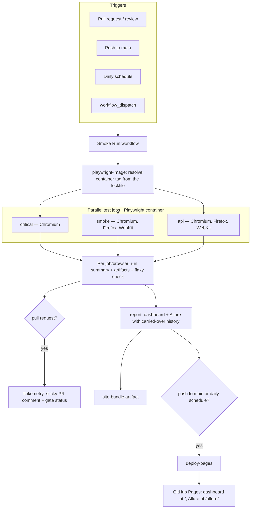

# CI pipeline

How GitHub Actions runs tests, publishes artifacts, deploys the live test-health dashboard and Allure report, and keeps dependencies current.

## Test runtime

Every test job runs inside the official Playwright image, which ships browsers and OS dependencies preinstalled, so there is no `playwright install` step. The image has to match the installed `@playwright/test`, so it is never written by hand: a `playwright-image` job at the start of each workflow reads the version from `package-lock.json` and outputs `mcr.microsoft.com/playwright:v<version>-noble`, and every test job takes its container image from that output. A Playwright upgrade is therefore a lockfile change and nothing else. The container runs with `--security-opt seccomp=unconfined`, `HOME=/root`, and `PLAYWRIGHT_BROWSERS_PATH=/ms-playwright`, which Firefox needs to launch as root inside the job container.

## PR, `main`, and daily flow (Smoke Run)

Triggered on pull requests (opened, synchronize, reopened), submitted reviews (approved, changes requested, commented), pushes to `main`, a daily schedule (`17 3 * * *`, 03:17 UTC), and manual dispatch. Runs in parallel with [Code Quality Checks](../.github/workflows/code-quality.yml) (typecheck, ESLint, Prettier) on pull requests and pushes.

```mermaid
flowchart TD
    subgraph triggers [Triggers]
        PR[Pull request / review]
        MAIN[Push to main]
        DAILY[Daily schedule]
        WD[workflow_dispatch]
    end

    triggers --> SR[Smoke Run workflow]
    SR --> IMG[playwright-image: resolve container tag from the lockfile]

    subgraph parallel [Parallel test jobs · Playwright container]
        C[critical — Chromium]
        S[smoke — Chromium, Firefox, WebKit]
        A[api — Chromium, Firefox, WebKit]
    end

    IMG --> C
    IMG --> S
    IMG --> A

    C --> ART[Per job/browser: run summary + artifacts + flaky check]
    S --> ART
    A --> ART

    ART --> FM{pull request?}
    FM -->|yes| INSIGHT[flakemetry: sticky PR comment + gate status]

    ART --> REPORT[report: dashboard + Allure with carried-over history]
    REPORT --> BUNDLE[site-bundle artifact]
    REPORT --> PAGES{push to main or daily schedule?}
    PAGES -->|yes| DEPLOY[deploy-pages]
    DEPLOY --> LIVE["GitHub Pages: dashboard at /, Allure at /allure/"]
```

### Steps inside each test job

1. `npm ci`, then the suite for the matrix browser (`test:critical:*`, `test:smoke:*`, `test:api:*`).
2. **Test run summary** — `scripts/run-summary.mjs` writes status, counts, failures, and the slowest tests to the job summary.
3. Artifact uploads (always): `run-json-<job>-<browser>`, `flakemetry-<job>-<browser>`, `allure-results-<job>-<browser>`, `playwright-report-<job>-<browser>`; on failure also `test-results-<job>-<browser>`.
4. **Flaky test detection report** — `npm run report:flaky` with `FAIL_ON_FLAKY=true`, so a test that flakes within its own run fails the job.

### Job summary

| Job                                           | Suite       | Browsers                  | Output                                                                                     |
| --------------------------------------------- | ----------- | ------------------------- | ------------------------------------------------------------------------------------------ |
| `playwright-image` (Resolve Playwright image) | —           | —                         | Container image matching `@playwright/test` in the lockfile                                |
| `critical`                                    | `@critical` | Chromium                  | Run summary, artifacts listed above                                                        |
| `smoke`                                       | `@smoke`    | Chromium, Firefox, WebKit | Same                                                                                       |
| `api`                                         | `tests/api` | Chromium, Firefox, WebKit | Same                                                                                       |
| `flakemetry` (Flakemetry insight)             | —           | —                         | Sticky PR comment and `flakemetry/gate` status; skipped until secrets set                  |
| `report` (Build report site)                  | —           | —                         | Dashboard (`index.html`, `badge.json`, `trend.json`) + Allure → `site-bundle`              |
| `deploy-pages` (Deploy to GitHub Pages)       | —           | —                         | Publishes `site-bundle` to GitHub Pages on a push to `main` or the daily run (`main` only) |

The `flakemetry` job uses the Flakemetry PR-comment and gate actions pinned to a full commit SHA rather than a branch, because they run with the Flakemetry token and write access to pull requests and statuses. Moving to a newer version of those actions means changing the SHA.

### Report site and history

The `report` job downloads every `run-json-*` and `allure-results-*` artifact and builds one site:

- **Dashboard** at the site root — `scripts/build-dashboard.mjs` aggregates the per-job reports into `index.html`, `badge.json` (the README badge), and `trend.json`. The previous deploy's `trend.json` is fetched first so the pass-rate trend accumulates.
- **Allure report** under `/allure/` — Allure 3 keeps run history in a JSONL file set by `historyPath` in [allurerc.mjs](../allurerc.mjs). The job fetches the previous deploy's `/allure/history.jsonl`, generates the report with `ALLURE_HISTORY_PATH` pointing at it (Allure appends the current run, capped at 30), and publishes the updated file with the report, so the trend charts advance on every deploy. On the first deploy there is no history yet, which is expected.

Because the daily run deploys too, both trends gain one point per day even when nothing is merged, so the published site always reflects the current health of `main`.

## Nightly regression

[Regression Run](../.github/workflows/nightly-regression.yml) runs on a schedule (`0 1 * * *`) and `workflow_dispatch`. Its `playwright-image` job resolves the container image the same way, and the `regression` job runs `@regression` on Chromium, Firefox, and WebKit. The tag covers 17 tests per browser: 12 UI scenarios in `tests/regression` and 5 network-interception specs in `tests/api`. Each browser writes a run summary and uploads `flakemetry-*`, `allure-results-*`, `playwright-report-*`, and failure media; the `allure-report` job merges the results into an `allure-report-bundle` artifact. Nothing is deployed to GitHub Pages.

## Dependency updates

[Dependabot](../.github/dependabot.yml) checks npm packages and GitHub Actions weekly:

- **npm** — minor and patch updates arrive as one grouped pull request (`build(deps)` / `build(deps-dev)`). Major versions are not proposed; they are taken on deliberately.
- **GitHub Actions** — all action updates arrive as one grouped pull request (`ci(deps)`). The commit-pinned Flakemetry actions are not touched.

Playwright updates come through the npm group and need no workflow edit, because the container image is resolved from the lockfile. Dependabot alerts are enabled for the repository, so a known vulnerability is flagged even before the weekly run.

## Related docs

- [Test strategy](test-strategy.md)
- [Architecture diagram and runtime flow](architecture.md)
- [Troubleshooting appendix](troubleshooting.md)
- [Flakemetry integration guide](flakemetry-guide.md)
- [Live test-health dashboard](https://akogut.github.io/playwright-ecommerce-framework/) · [Allure report](https://akogut.github.io/playwright-ecommerce-framework/allure/)
- Workflow sources: `.github/workflows/pr-review-smoke.yml`, `.github/workflows/nightly-regression.yml`, `.github/workflows/code-quality.yml`, `.github/dependabot.yml`
