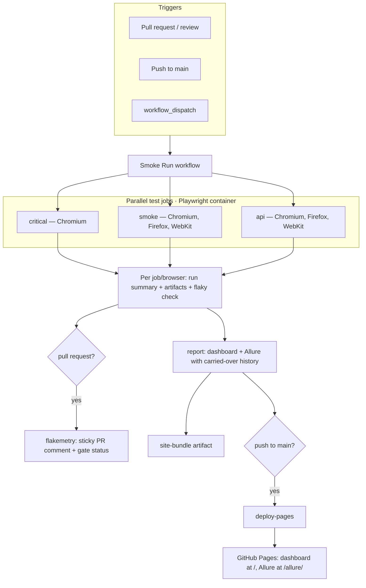

# CI pipeline

How GitHub Actions runs tests, publishes artifacts, and deploys the live test-health dashboard and Allure report.

## Test runtime

Every test job runs inside the official Playwright image (`mcr.microsoft.com/playwright:v1.59.1-noble`), which ships browsers and OS dependencies preinstalled, so there is no `playwright install` step. The image tag must match `@playwright/test` in `package.json`. The container runs with `--security-opt seccomp=unconfined`, `HOME=/root`, and `PLAYWRIGHT_BROWSERS_PATH=/ms-playwright`, which Firefox needs to launch as root inside the job container.

## PR and `main` push flow (Smoke Run)

Triggered on pull requests (opened, synchronize, reopened), submitted reviews (approved, changes requested, commented), pushes to `main`, and manual dispatch. Runs in parallel with [Code Quality Checks](../.github/workflows/code-quality.yml) (typecheck, ESLint, Prettier).

```mermaid
flowchart TD
    subgraph triggers [Triggers]
        PR[Pull request / review]
        MAIN[Push to main]
        WD[workflow_dispatch]
    end

    triggers --> SR[Smoke Run workflow]

    subgraph parallel [Parallel test jobs · Playwright container]
        C[critical — Chromium]
        S[smoke — Chromium, Firefox, WebKit]
        A[api — Chromium, Firefox, WebKit]
    end

    SR --> C
    SR --> S
    SR --> A

    C --> ART[Per job/browser: run summary + artifacts + flaky check]
    S --> ART
    A --> ART

    ART --> FM{pull request?}
    FM -->|yes| INSIGHT[flakemetry: sticky PR comment + gate status]

    ART --> REPORT[report: dashboard + Allure with carried-over history]
    REPORT --> BUNDLE[site-bundle artifact]
    REPORT --> PAGES{push to main?}
    PAGES -->|yes| DEPLOY[deploy-pages]
    DEPLOY --> LIVE["GitHub Pages: dashboard at /, Allure at /allure/"]
```

### Steps inside each test job

1. `npm ci`, then the suite for the matrix browser (`test:critical:*`, `test:smoke:*`, `test:api:*`).
2. **Test run summary** — `scripts/run-summary.mjs` writes status, counts, failures, and the slowest tests to the job summary.
3. Artifact uploads (always): `run-json-<job>-<browser>`, `flakemetry-<job>-<browser>`, `allure-results-<job>-<browser>`, `playwright-report-<job>-<browser>`; on failure also `test-results-<job>-<browser>`.
4. **Flaky test detection report** — `npm run report:flaky` with `FAIL_ON_FLAKY=true`, so a test that flakes within its own run fails the job.

### Job summary

| Job                                     | Suite       | Browsers                  | Output                                                                        |
| --------------------------------------- | ----------- | ------------------------- | ----------------------------------------------------------------------------- |
| `critical`                              | `@critical` | Chromium                  | Run summary, artifacts listed above                                           |
| `smoke`                                 | `@smoke`    | Chromium, Firefox, WebKit | Same                                                                          |
| `api`                                   | `tests/api` | Chromium, Firefox, WebKit | Same                                                                          |
| `flakemetry` (Flakemetry insight)       | —           | —                         | Sticky PR comment and `flakemetry/gate` status; skipped until secrets set     |
| `report` (Build report site)            | —           | —                         | Dashboard (`index.html`, `badge.json`, `trend.json`) + Allure → `site-bundle` |
| `deploy-pages` (Deploy to GitHub Pages) | —           | —                         | Publishes `site-bundle` to GitHub Pages (`main` push only)                    |

### Report site and history

The `report` job downloads every `run-json-*` and `allure-results-*` artifact and builds one site:

- **Dashboard** at the site root — `scripts/build-dashboard.mjs` aggregates the per-job reports into `index.html`, `badge.json` (the README badge), and `trend.json`. The previous deploy's `trend.json` is fetched first so the pass-rate trend accumulates.
- **Allure report** under `/allure/` — Allure 3 keeps run history in a JSONL file set by `historyPath` in [allurerc.mjs](../allurerc.mjs). The job fetches the previous deploy's `/allure/history.jsonl`, generates the report with `ALLURE_HISTORY_PATH` pointing at it (Allure appends the current run, capped at 30), and publishes the updated file with the report, so the trend charts advance on every deploy. On the first deploy there is no history yet, which is expected.

## Nightly regression

[Regression Run](../.github/workflows/nightly-regression.yml) runs on a schedule (`0 1 * * *`) and `workflow_dispatch`. The `regression` job runs `@regression` on Chromium, Firefox, and WebKit in the same Playwright container. The tag covers 17 tests per browser: 12 UI scenarios in `tests/regression` and 5 network-interception specs in `tests/api`. Each browser writes a run summary and uploads `flakemetry-*`, `allure-results-*`, `playwright-report-*`, and failure media; the `allure-report` job merges the results into an `allure-report-bundle` artifact. Nothing is deployed to GitHub Pages.

## Related docs

- [Test strategy](test-strategy.md)
- [Architecture diagram and runtime flow](architecture.md)
- [Troubleshooting appendix](troubleshooting.md)
- [Flakemetry integration guide](flakemetry-guide.md)
- [Live test-health dashboard](https://akogut.github.io/playwright-ecommerce-framework/) · [Allure report](https://akogut.github.io/playwright-ecommerce-framework/allure/)
- Workflow sources: `.github/workflows/pr-review-smoke.yml`, `.github/workflows/nightly-regression.yml`, `.github/workflows/code-quality.yml`
