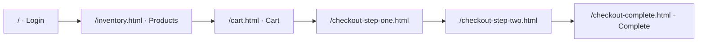

# Demo Screenshots

Visual evidence of the **automated user journey** this framework protects. Each screen maps to Page Objects, selectors, and tagged specs documented in the [Test strategy coverage matrix](test-strategy.md#coverage-matrix).

## End-to-end journey



| Step | Route | Page Object | Representative specs |
| ---- | ----- | ----------- | -------------------- |
| 1 | `/` | `loginPage` | `login-valid.spec.ts` · `login-invalid-credentials.spec.ts` |
| 2 | `/inventory.html` | `productsPage` | `products-list-visible.spec.ts` · `add-product-to-cart.spec.ts` |
| 3 | `/cart.html` | `cartPage` | `cart-add-multiple-products.spec.ts` · `cart-remove-product.spec.ts` |
| 4–5 | `/checkout-step-*` | `checkoutPage` | `checkout-happy-path.spec.ts` · `checkout-missing-*.spec.ts` |
| 6 | `/checkout-complete.html` | `checkoutPage` | `checkout-happy-path.spec.ts` (`@smoke @critical`) |

Selector policy for these screens: [UI audit](ui-audit-saucedemo.md).

---

## Login page

<figure>
  
  <figcaption><strong>Login (<code>/</code>)</strong> — Authentication boundary for every scenario. The <code>auth</code> fixture loads credentials from <code>.env</code>; smoke and critical suites assert redirect to inventory after <code>standard_user</code> sign-in.</figcaption>
</figure>

---

## Products page

<figure>
  
  <figcaption><strong>Inventory (<code>/inventory.html</code>)</strong> — Post-login catalog. Smoke coverage validates list visibility and add-to-cart; regression extends to multi-item baskets and removal flows.</figcaption>
</figure>

---

## Checkout complete page

<figure>
  
  <figcaption><strong>Order confirmation (<code>/checkout-complete.html</code>)</strong> — Terminal state of the purchase path. Tagged <code>@smoke @critical</code> in <code>checkout-happy-path.spec.ts</code>; primary signal that cart → checkout → completion remains intact.</figcaption>
</figure>

---

## Regenerating screenshots

When the AUT UI changes, capture at **1366×768** (framework viewport) for consistency with CI:

```bash
npm run test:headed -- tests/smoke/login-valid.spec.ts
# or use Playwright codegen against BASE_URL
```

Replace assets under `docs/assets/` and verify captions still match DOM landmarks (`data-test` ids).
