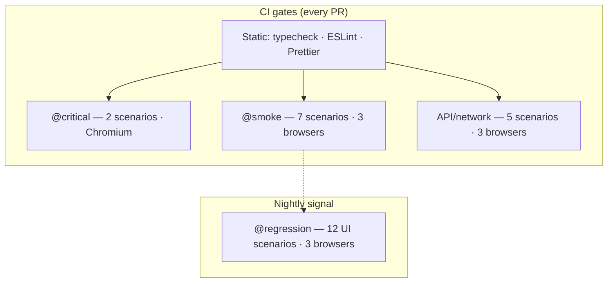
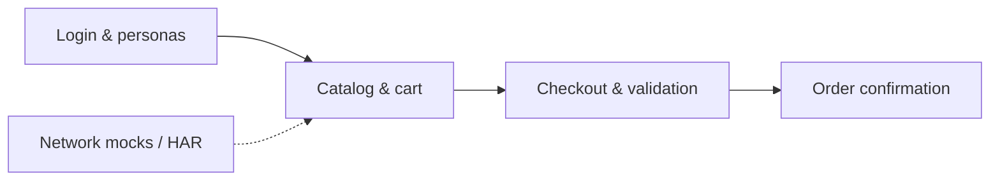
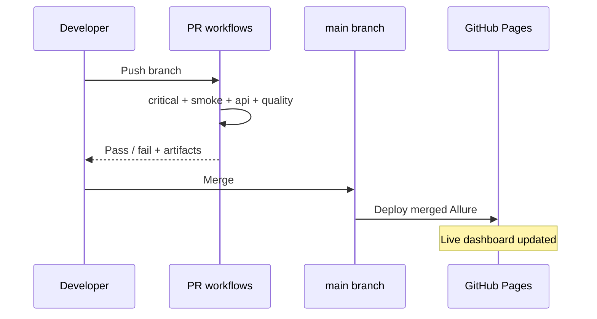

# Quality Overview

> **One-page summary** for reviewers, hiring managers, and stakeholders.  
> **Depth:** [Test strategy](test-strategy.md) · **Evidence:** [Live Allure report](https://akogut.github.io/playwright-ecommerce-framework/)

---

## The problem this solves

E-commerce E2E suites decay when selectors, credentials, and reporting logic scatter across spec files. Changes become expensive; CI feedback slows; failures are hard to triage.

## The approach

A **layered Playwright + TypeScript framework** targeting [SauceDemo](https://www.saucedemo.com/) with production-shaped practices: Page Objects, typed fixtures, tagged suites, health-checked environments, and multi-browser CI with published Allure.

---

## At a glance

| Metric              |                                                                           Value |
| ------------------- | ------------------------------------------------------------------------------: |
| Automated scenarios |                                                                          **24** |
| Browsers (desktop)  |                                                       Chromium, Firefox, WebKit |
| PR merge gates      |                                            `@critical` · `@smoke` · `tests/api` |
| Nightly depth       |                                               `@regression` (12 UI + 5 network) |
| Live report         | [GitHub Pages Allure](https://akogut.github.io/playwright-ecommerce-framework/) |

---

## Test pyramid

**Interpretation:** Fast, high-signal checks run on every pull request; broader negative and edge coverage runs on a schedule without blocking day-to-day merges.

---

## What gets protected

| Journey stage  | PR coverage         | Nightly coverage                        |
| -------------- | ------------------- | --------------------------------------- |
| Authentication | Smoke + critical    | Invalid, locked, empty fields, personas |
| Catalog / cart | Smoke               | Multi-item, remove, totals              |
| Checkout       | Critical happy path | Missing field validation                |
| Network layer  | API specs           | Same (contract stability)               |

Visual proof: [Demo screenshots](demo-screenshots.md).

---

## Engineering maturity signals

| Practice                       | Implementation                                                             |
| ------------------------------ | -------------------------------------------------------------------------- |
| **Separation of concerns**     | Specs → fixtures → Page Objects → selectors                                |
| **Deterministic targeting**    | `data-test` locators ([UI audit](ui-audit-saucedemo.md))                   |
| **Environment safety**         | `.env` + health-check retries in global setup                              |
| **Tag hygiene**                | `untagged-chromium` project catches classification gaps                    |
| **Failure observability**      | Screenshot, video, trace on failure; Allure in CI                          |
| **Cross-browser confidence**   | Matrix jobs per suite ([CI pipeline](ci-pipeline.md))                      |
| **Focused quality checks**     | Accessibility smoke scan and opt-in login visual baseline                  |
| **Documentation traceability** | [Coverage matrix](test-strategy.md#coverage-matrix) maps capability → spec |

---

## CI feedback loop

| Workflow                                                                                                                | When      | Outcome                |
| ----------------------------------------------------------------------------------------------------------------------- | --------- | ---------------------- |
| [Smoke Run](https://github.com/AKogut/playwright-ecommerce-framework/actions/workflows/pr-review-smoke.yml)             | Every PR  | Merge gate + artifacts |
| [Code Quality](https://github.com/AKogut/playwright-ecommerce-framework/actions/workflows/code-quality.yml)             | Every PR  | Static analysis gate   |
| [Nightly Regression](https://github.com/AKogut/playwright-ecommerce-framework/actions/workflows/nightly-regression.yml) | 01:00 UTC | Depth signal           |

---

## 60-second evaluation path

1. Read [Portfolio highlights](../README.md#portfolio-highlights) in the README.
2. Open the **[live Allure report](https://akogut.github.io/playwright-ecommerce-framework/)** — latest `main` smoke run.
3. Skim the **[coverage matrix](test-strategy.md#coverage-matrix)** — 24 scenarios with file names.
4. Review **[Architecture](architecture.md)** — layers and fixture model.
5. Optional: clone, `npm ci`, `npm run test:smoke` ([Setup guide](setup-guide.md)).

---

## Drill-down index

| Question                               | Document                                |
| -------------------------------------- | --------------------------------------- |
| Full strategy, risk model, checklists? | [Test strategy](test-strategy.md)       |
| How are tags and projects wired?       | [Tag strategy](tag-strategy.md)         |
| Repo layout and conventions?           | [Folder structure](folder-structure.md) |
| Something failed — what now?           | [Troubleshooting](troubleshooting.md)   |
| All guides                             | [Documentation hub](README.md)          |

---

_This page is intentionally concise. Detailed tables and decision frameworks live in linked guides to avoid drift._
