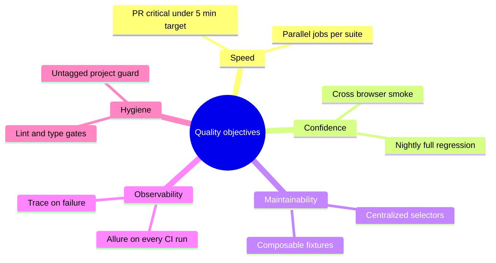
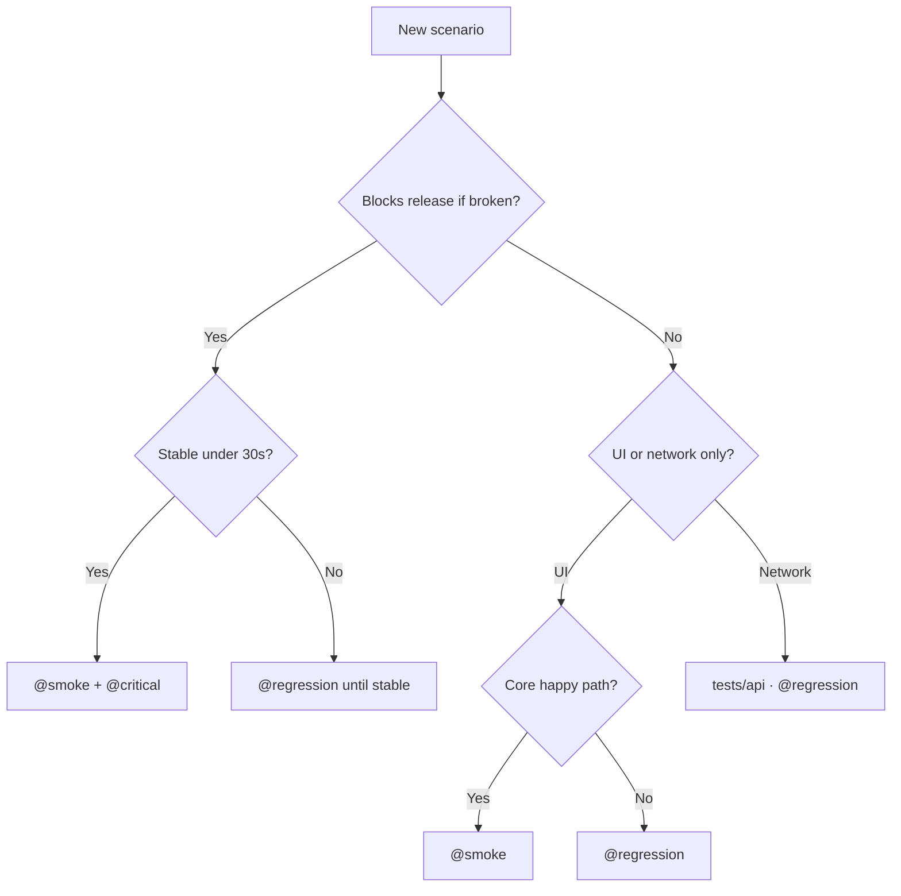

# Test Strategy

**Status:** Active · **AUT:** [SauceDemo](https://www.saucedemo.com/) · **Stack:** Playwright, TypeScript, Allure, GitHub Actions

This document is the authoritative quality plan for the framework: what we protect, how suites are tiered, and how automation maps to CI gates. It is written for engineers, reviewers, and QA leads evaluating test maturity in a portfolio context.

---

## Executive summary

| Dimension | Decision |
| --------- | -------- |
| **Primary goal** | Prevent regressions in revenue-critical e-commerce flows before merge |
| **Secondary goal** | Maintain a fast, deterministic PR signal across desktop browsers |
| **Automation style** | Layered Page Objects + typed fixtures; specs stay scenario-focused |
| **Feedback model** | Tiered suites (`@critical` → `@smoke` → `@regression`) with parallel CI jobs |
| **Evidence model** | Multi-reporter output (HTML, JUnit, JSON, Allure) + failure-only media |
| **Current scale** | **23** automated scenarios across UI E2E and network isolation |

The framework treats SauceDemo as a **production-shaped** target: real browser automation, cross-browser matrices, health-checked environments, and published trend reports—not a demo script collection.

---

## Quality objectives



| Objective | How we achieve it | Measured by |
| --------- | ----------------- | ----------- |
| **Fast merge signal** | `@critical` on Chromium only; smoke/api parallelized | PR workflow duration, critical job pass rate |
| **Broad compatibility** | Smoke + regression × Chromium, Firefox, WebKit | Per-browser job matrix in Actions |
| **Low flake tax** | Auto-waiting locators, health-check retries, CI `retries: 2` | Re-run rate, untagged + nightly stability |
| **Debuggability** | `retain-on-failure` trace/video/screenshot | Time-to-root-cause from artifacts |
| **Sustainable growth** | Tag + folder conventions, Page Object boundary | PR review time, selector churn |

---

## Scope boundary

### In scope

| Area | Coverage |
| ---- | -------- |
| **Identity** | Login, logout, persona variants (`standard`, `locked`, `problem`, `performance`) |
| **Catalog** | Product list visibility, add/remove, multi-item cart |
| **Commerce** | Checkout happy path, field validation, total/tax assertion |
| **Network layer** | Route mock, custom handler, HAR replay, route lifecycle |
| **Platforms** | Desktop Chromium, Firefox, WebKit (1366×768) |

### Explicitly out of scope

| Area | Rationale |
| ---- | --------- |
| Real payments / backends | AUT is a demo storefront |
| Visual regression / Percy | Cost vs value for training repo; selectors + functional asserts preferred |
| Mobile native | Web-only mandate |
| a11y automation | Not in current charter; manual audit reference in [UI audit](ui-audit-saucedemo.md) |
| Load testing | Separate discipline; `performance_glitch_user` used only for persona behavior |

Selector and journey details: [UI audit for SauceDemo](ui-audit-saucedemo.md).

---

## Test pyramid and layers

```mermaid
flowchart TB
    subgraph L1["Layer 1 — UI E2E (majority)"]
        direction LR
        SM[@smoke · 6 scenarios]
        RG[@regression · 12 scenarios]
    end
    subgraph L2["Layer 2 — Network contracts"]
        API[tests/api · 5 scenarios]
    end
    subgraph L3["Layer 3 — Static gates"]
        ST[typecheck · lint · format]
    end
    L1 --> AUT[(SauceDemo)]
    L2 --> AUT
    ST --> L1
```

| Layer | Location | Responsibility |
| ----- | -------- | -------------- |
| **UI E2E** | `tests/smoke`, `tests/regression` | End-user journeys via Page Objects (`@fx/ui`) |
| **Network** | `tests/api` | Isolate `network` fixture without full UI state |
| **Static** | `npm run typecheck`, `lint`, `format` | Catch defects before browser spin-up |

**Design rule:** UI specs never embed raw selectors; network specs never depend on checkout UI unless validating integration.

---

## Suite taxonomy

`@critical` is a **priority overlay**, not a separate folder. It marks scenarios that must never fail on PR.

```mermaid
flowchart LR
    PR[Pull request] --> CR[@critical · Chromium]
    PR --> SM[@smoke · 3 browsers]
    PR --> API[tests/api · 3 browsers]
    NT[Nightly 01:00 UTC] --> RG[@regression · 3 browsers]
```

| Suite | Tag / path | Intent | CI trigger | Browsers |
| ----- | ---------- | ------ | ---------- | -------- |
| **Critical** | `@critical` + `@smoke` | Non-negotiable merge gate | PR Smoke Run | Chromium |
| **Smoke** | `@smoke` | Core journey confidence | PR Smoke Run | Chromium, Firefox, WebKit |
| **Regression** | `@regression` | Negatives, edge cases, depth | Nightly + local | All three |
| **API** | `tests/api` | Network fixture contracts | PR Smoke Run | All three (`workers=1`) |
| **Hygiene** | `untagged-chromium` | Detect missing tags | Local / optional | Chromium |

Tag mechanics and commands: [Tag strategy](tag-strategy.md). Pipeline diagram: [CI pipeline](ci-pipeline.md).

---

## Coverage matrix

Full traceability from business capability → spec file → suite tag.

### Critical + smoke (PR gate)

| Capability | Spec | Tags |
| ---------- | ---- | ---- |
| Valid login → inventory | `tests/smoke/login-valid.spec.ts` | `@smoke @critical` |
| Product catalog visible | `tests/smoke/products-list-visible.spec.ts` | `@smoke` |
| Add item to cart | `tests/smoke/add-product-to-cart.spec.ts` | `@smoke` |
| Checkout happy path | `tests/smoke/checkout-happy-path.spec.ts` | `@smoke @critical` |
| Logout | `tests/smoke/logout.spec.ts` | `@smoke` |
| Alternate personas sanity | `tests/smoke/login-alternate-personas-sanity.spec.ts` | `@smoke` |

### Regression (nightly depth)

| Capability | Spec | Tags |
| ---------- | ---- | ---- |
| Empty username validation | `tests/regression/login-empty-username.spec.ts` | `@regression` |
| Empty password validation | `tests/regression/login-empty-password.spec.ts` | `@regression` |
| Invalid credentials | `tests/regression/login-invalid-credentials.spec.ts` | `@regression` |
| Locked user denied | `tests/regression/login-locked-user.spec.ts` | `@regression` |
| Problem user login | `tests/regression/login-problem-user.spec.ts` | `@regression` |
| Performance user login | `tests/regression/login-performance-user.spec.ts` | `@regression` |
| Missing first name at checkout | `tests/regression/checkout-missing-first-name.spec.ts` | `@regression` |
| Missing last name | `tests/regression/checkout-missing-last-name.spec.ts` | `@regression` |
| Missing postal code | `tests/regression/checkout-missing-postal-code.spec.ts` | `@regression` |
| Cart total vs tax | `tests/regression/checkout-validate-cart-total.spec.ts` | `@regression` |
| Multi-product cart | `tests/regression/cart-add-multiple-products.spec.ts` | `@regression` |
| Remove from cart | `tests/regression/cart-remove-product.spec.ts` | `@regression` |

### API / network (PR gate)

| Capability | Spec | Tags |
| ---------- | ---- | ---- |
| Mock HTTP status + headers | `tests/api/network-intercept-mock-status.spec.ts` | `@regression` |
| Mock JSON body | `tests/api/network-intercept-mock-api.spec.ts` | `@regression` |
| Custom route handler | `tests/api/network-intercept-custom-handler.spec.ts` | `@regression` |
| HAR replay | `tests/api/network-intercept-har-replay.spec.ts` | `@regression` |
| Clear routes + re-mock | `tests/api/network-intercept-clear-routes.spec.ts` | `@regression` |

---

## Risk model

Business risk drives suite placement—not folder convenience.

| Rank | Risk domain | Why it matters | Suite placement |
| ---- | ----------- | -------------- | --------------- |
| 1 | Authentication | Blocks all downstream value | `@smoke @critical` |
| 2 | Purchase completion | Direct revenue proxy on real systems | `@smoke @critical` |
| 3 | Catalog + cart | Discovery and basket integrity | `@smoke` |
| 4 | Form / access validation | Compliance and UX trust | `@regression` |
| 5 | Network isolation | Enables deterministic future UI tests | `tests/api` |

### Decision framework: where does a new test go?



---

## Quality attributes (test design standards)

| Attribute | Standard | Anti-pattern |
| --------- | -------- | ------------ |
| **Determinism** | `data-test` locators, fixture-driven data | `waitForTimeout`, CSS nth-child chains |
| **Isolation** | Each spec sets up own session via `auth` | Shared global state between parallel tests |
| **Readability** | Title describes behavior + tags | Logic buried in spec, not Page Object |
| **Observability** | Failures produce trace in CI | Swallowing errors without assertion |
| **Portability** | Env-driven `BASE_URL` and users | Hard-coded credentials in specs |

Implementation reference: [Architecture](architecture.md).

---

## CI quality gates

| Gate | Workflow | Failure impact |
| ---- | -------- | -------------- |
| Static analysis | `code-quality.yml` | PR blocked |
| Critical suite | `pr-review-smoke.yml` → `critical` | PR blocked |
| Smoke matrix | same → `smoke` × 3 browsers | PR blocked |
| API matrix | same → `api` × 3 browsers | PR blocked |
| Regression | `nightly-regression.yml` | Signal for drift; investigate next day |
| Live report | `deploy-allure-pages` on `main` | Portfolio / stakeholder visibility |

**Retries:** CI runs with `retries: 2` to absorb transient AUT/network noise; chronic flakes require a tracked issue and fix—not silent retry acceptance.

---

## Entry and exit criteria

### Author — before opening PR

- [ ] `npm run typecheck && npm run lint && npm run format` — green
- [ ] `npm run test:smoke` — green locally
- [ ] `npm run test:api` — green if `tests/api` or `network` fixture touched
- [ ] `npm run test:untagged` — no unexpected specs
- [ ] New tests include `@smoke` or `@regression`; `@critical` only with justification
- [ ] Page Objects / selectors updated—not inline locators in specs

### Reviewer — before approve

- [ ] Scenario maps to [coverage matrix](#coverage-matrix) or extends it with clear risk note
- [ ] No scope creep (payment, visual, mobile) without strategy update
- [ ] CI artifacts strategy unchanged or documented

### Release / demo readiness (`main`)

- [ ] All PR gates green on merge commit
- [ ] Nightly regression green within last 24h
- [ ] [Live Allure](https://akogut.github.io/playwright-ecommerce-framework/) reflects latest smoke run

---

## Adding a new scenario (checklist)

1. **Classify** using the [decision framework](#decision-framework-where-does-a-new-test-go).
2. **Place** file under `tests/smoke`, `tests/regression`, or `tests/api`.
3. **Implement** via `@fx/ui`; extend `src/page-objects` and `src/selectors` first.
4. **Tag** in test title: `@smoke`, `@regression`, and optionally `@critical`.
5. **Verify** targeted project: `npm run test:smoke:chromium` (or relevant browser).
6. **Update** this coverage matrix in the same PR.

---

## Related documentation

| Document | Use when |
| -------- | -------- |
| [Quality overview](quality-overview.md) | Executive / hiring review (one page) |
| [Documentation hub](README.md) | Navigating all guides |
| [Architecture](architecture.md) | Understanding layers and fixtures |
| [Tag strategy](tag-strategy.md) | Projects, grep, npm scripts |
| [CI pipeline](ci-pipeline.md) | Jobs, artifacts, Pages deploy |
| [Troubleshooting](troubleshooting.md) | Failure triage |
| [Contributing](../CONTRIBUTING.md) | PR and commit conventions |
