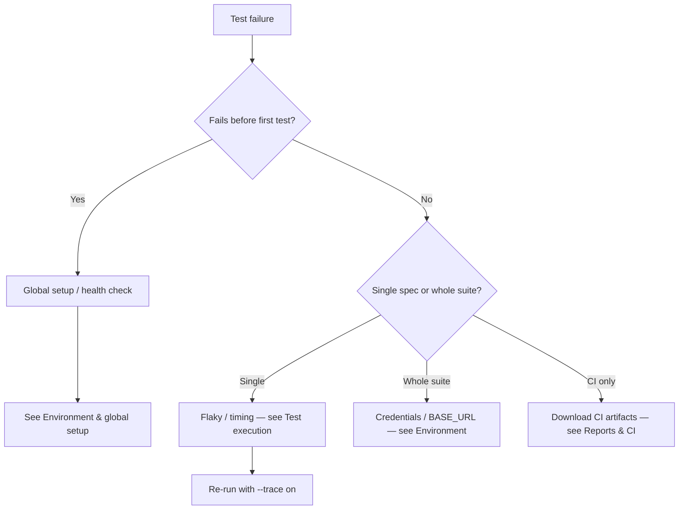

# Troubleshooting Appendix

**Purpose:** Reduce mean time to recovery (MTTR) for local development and CI failures.  
**Audience:** Contributors, reviewers triaging PR checks, on-call engineers.  
**Prerequisite:** [Setup guide](setup-guide.md) completed successfully at least once.

---

## Quick diagnostic flow

Start here when a run fails and the cause is unclear.



---

## Symptom index

| Symptom                             | Likely cause                  | Section                                                         |
| ----------------------------------- | ----------------------------- | --------------------------------------------------------------- |
| `engine` / Node version warnings    | Wrong Node.js                 | [Node version mismatch](#node-version-mismatch)                 |
| `Executable doesn't exist`          | Browsers not installed        | [Playwright browsers](#playwright-browsers-missing-or-outdated) |
| Login fails for all specs           | `.env` missing or wrong users | [Environment file](#env-not-loaded-or-wrong-credentials)        |
| Run aborts immediately, no tests    | Health check / `BASE_URL`     | [Health check fails](#base-url-health-check-fails)              |
| Run stops mid-suite, queue left     | Global timeout                | [Global timeout](#global-timeout-exceeded)                      |
| Unexpected specs in untagged run    | Missing suite or overlay tag  | [Untagged tests](#untagged-tests-discovered)                    |
| Passes locally, fails in CI         | Timing / parallelism / env    | [Flaky failures](#flaky-or-order-dependent-failures)            |
| API specs pass alone, fail in batch | Route leakage                 | [API interference](#api-tests-interfere-with-each-other)        |
| Commit rejected                     | Husky / lint                  | [Static analysis](#eslint-or-prettier-failures-on-commit)       |
| Empty Allure locally                | No prior test run             | [Allure stale](#allure-report-empty-or-stale)                   |
| Cannot find trace from PR           | Wrong artifact                | [CI artifacts](#ci-artifacts-hard-to-find)                      |

---

## Environment and toolchain

### Node version mismatch

|              |                                                                              |
| ------------ | ---------------------------------------------------------------------------- |
| **Symptoms** | npm `EBADENGINE`, Playwright install errors, inconsistent `node` vs `.nvmrc` |
| **Impact**   | High — entire toolchain unreliable                                           |
| **Fix**      |                                                                              |

```bash
nvm use || nvm install
node --version    # expect v24.x
npm ci
```

**Prevention:** Add `nvm use` to shell profile or use the IDE’s Node version from `.nvmrc`.

---

### Playwright browsers missing or outdated

|              |                                                                                                 |
| ------------ | ----------------------------------------------------------------------------------------------- |
| **Symptoms** | `browserType.launch: Executable doesn't exist`, failures right after `@playwright/test` upgrade |
| **Impact**   | High — no tests can run                                                                         |
| **Fix**      |                                                                                                 |

```bash
npx playwright install
npm run test:smoke:chromium   # smoke test one project
```

**Prevention:** Run `npx playwright install` after every major Playwright bump; document in PR description.

---

### `.env` not loaded or wrong credentials

|              |                                                                                                         |
| ------------ | ------------------------------------------------------------------------------------------------------- |
| **Symptoms** | Login assertions fail; `locked_out_user` behavior when expecting `standard_user`; “works on my machine” |
| **Impact**   | High — false negatives across smoke                                                                     |
| **Fix**      |                                                                                                         |

1. `cp .env.example .env`
2. Confirm `BASE_URL=https://www.saucedemo.com/` (or your fork)
3. Align credentials with [SauceDemo](https://www.saucedemo.com/) personas — never commit real secrets

**Prevention:** CI uses repository secrets / defaults; locally always start from `.env.example`.

---

## Global setup and connectivity

### Base URL health check fails

|              |                                                                                   |
| ------------ | --------------------------------------------------------------------------------- |
| **Symptoms** | Global setup exits; log references health check, `BASE_URL`, or retries exhausted |
| **Impact**   | Critical — zero tests execute                                                     |
| **Fix**      |                                                                                   |

1. **Network:** VPN, proxy, corporate firewall blocking `BASE_URL`
2. **Tune retries** (`.env`):
   - `BASE_URL_HEALTHCHECK_RETRIES=5`
   - `BASE_URL_HEALTHCHECK_BACKOFF_MS=3000`
3. **Isolate:** `SKIP_BASE_URL_HEALTHCHECK=true` **only** to confirm connectivity vs test bug — revert before merge

**Prevention:** Keep health check enabled in CI; monitor SauceDemo availability for nightly regressions.

---

### Global timeout exceeded

|              |                                                                     |
| ------------ | ------------------------------------------------------------------- |
| **Symptoms** | Playwright aborts entire run; many tests `skipped` or never started |
| **Impact**   | Medium — often local misconfiguration                               |
| **Fix**      |                                                                     |

- Reduce scope: `npm run test:smoke:chromium`
- Increase `GLOBAL_TIMEOUT_MS` temporarily for investigation
- Kill zombie browsers: `pkill -f chromium` / `firefox` / `webkit` (macOS/Linux)

**Prevention:** Do not run full `npm test` on laptops when debugging a single spec.

---

## Test execution

### Untagged tests discovered

|              |                                                                                              |
| ------------ | -------------------------------------------------------------------------------------------- |
| **Symptoms** | `npm run test:untagged` picks up new or changed specs                                        |
| **Impact**   | Medium — breaks tag hygiene gate                                                             |
| **Fix**      | Add the right suite or overlay tag to the test **title** per [Tag strategy](tag-strategy.md) |

**Prevention:** Run `npm run test:untagged` in pre-push habit; reviewer checks tags in PR.

---

### Flaky or order-dependent failures

|              |                                                                       |
| ------------ | --------------------------------------------------------------------- |
| **Symptoms** | Intermittent timeouts; different outcome local vs CI; passes on retry |
| **Impact**   | High — erodes trust in gates                                          |
| **Fix**      |                                                                       |

| Step | Action                                                                         |
| ---- | ------------------------------------------------------------------------------ |
| 1    | Replace fixed sleeps with Page Object actions and `expect` auto-wait           |
| 2    | Reproduce headed: `npx playwright test <spec> --headed --trace on`             |
| 3    | CI: download `test-results-<job>-<browser>` → open `trace.zip` in Trace Viewer |
| 4    | Check parallel isolation — no shared files, env mutation, or static counters   |

**Prevention:** Follow [Test strategy — quality attributes](test-strategy.md#quality-attributes-test-design-standards); file issue if flake persists after two CI retries.

---

### API tests interfere with each other

|              |                                                                     |
| ------------ | ------------------------------------------------------------------- |
| **Symptoms** | Mock routes from spec A affect spec B; order-dependent API failures |
| **Impact**   | Medium — confined to `tests/api`                                    |
| **Fix**      |                                                                     |

- Keep `npm run test:api` at `--workers=1` (do not parallelize API suite)
- Call `network.clearRoutes()` when overriding routes mid-spec
- Pattern reference: `tests/api/network-intercept-clear-routes.spec.ts`

---

## Static analysis

### ESLint or Prettier failures on commit

|              |                             |
| ------------ | --------------------------- |
| **Symptoms** | Husky pre-commit hook fails |
| **Impact**   | Low — blocks commit only    |
| **Fix**      |                             |

```bash
npm run fix
npm run typecheck
```

---

### TypeScript errors in fixtures or page objects

|              |                                                                                    |
| ------------ | ---------------------------------------------------------------------------------- |
| **Symptoms** | `tsc --noEmit` fails after extending fixtures                                      |
| **Impact**   | Medium — PR quality gate fails                                                     |
| **Fix**      | Update `src/fixtures/ui.fixture.ts` merge types and all consumers in one changeset |

---

## Reports and CI

### No local HTML report after run

```bash
npm run report    # opens playwright-report/
```

Config: `playwright.config.ts` → `reporter: ['html', ...]`.

---

### Allure report empty or stale

|              |                                            |
| ------------ | ------------------------------------------ |
| **Symptoms** | `report:allure` shows old or empty results |
| **Fix**      | Run tests first, then generate             |

```bash
npm run test:smoke
npm run report:allure:generate
npm run report:allure:open
```

---

### CI artifacts hard to find

**Path:** GitHub → Actions → select workflow run → **Artifacts** at bottom.

| Artifact                            | When to use                                            |
| ----------------------------------- | ------------------------------------------------------ |
| `test-results-<job>-<browser>`      | **First choice** — trace, screenshot, video on failure |
| `playwright-report-<job>-<browser>` | HTML report per shard                                  |
| `allure-results-<job>-<browser>`    | Raw inputs for local Allure merge                      |
| `allure-report-bundle`              | Full merged HTML (all jobs)                            |

**Live dashboard (main):** [GitHub Pages Allure](https://akogut.github.io/playwright-ecommerce-framework/)

Pipeline reference: [CI pipeline](ci-pipeline.md).

---

## Debugging command reference

| Goal                         | Command                                                                   |
| ---------------------------- | ------------------------------------------------------------------------- |
| Interactive exploration      | `npm run test:ui`                                                         |
| Headed + trace on one spec   | `npx playwright test tests/smoke/login-valid.spec.ts --headed --trace on` |
| Single browser project       | `npm run test:regression:firefox`                                         |
| Flaky history (local script) | `npm run report:flaky`                                                    |

---

## Escalation

When the index and flowchart do not resolve the issue:

1. **Baseline:** Compare with latest green [Smoke Run on `main`](https://github.com/AKogut/playwright-ecommerce-framework/actions/workflows/pr-review-smoke.yml).
2. **Evidence bundle for issue:** spec path, project name (`smoke-chromium`), browser, trace zip, relevant `.env` **keys only** (not values).
3. **Open issue:** [GitHub Issues](https://github.com/AKogut/playwright-ecommerce-framework/issues) with reproduction steps.

---

## Related documentation

- [Setup guide](setup-guide.md)
- [Test strategy](test-strategy.md)
- [CI pipeline](ci-pipeline.md)
- [Architecture](architecture.md)
